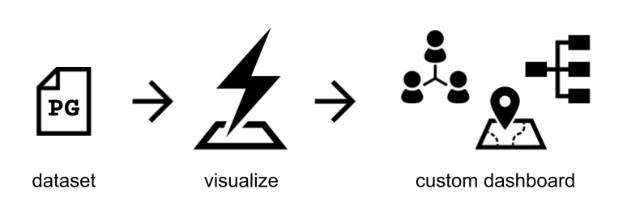

# Overview

Blitzboard is an open-source web tool to create custom dashboards for visualizing complex information, which may include relationships, dependencies, locations, and time. You can easily edit the data and configure its layouts, icons, labels, and more.&#x20;



* **Property Graph** is a data model which can represent complex information, and [PG format](https://pg-format.readthedocs.io/en/0.3/contents/pg-format.html) is a text serialization for property graph datasets&#x20;

`example.pg`

```
# NODES
101  :person  name:Alice  country:"United States"
102  :person  :student  name:Bob  country:Japan
# EDGES
101  -- 102  :same_school  :same_class  since:2012
101  -> 102  :likes  since:2015
```

Blitzboard can maintain multiple datasets with their respective visualization configurations, moreover, connect to databases to retrieve real-time information.

### Guides

Follow our handy guides to get started on the basics as quickly as possible:


[create-your-dashboard.md](guides/create-your-dashboard.md)



[configure-visualization.md](guides/configure-visualization.md)



[share-your-dashboard.md](guides/share-your-dashboard.md)


### Fundamentals

Learn the fundamentals of MyProduct to get a deeper understanding of our main features:


[node-options.md](visualization-config/node-options.md)



[edge-options.md](visualization-config/edge-options.md)



[layouts.md](visualization-config/layouts.md)



[others.md](visualization-config/others.md)

