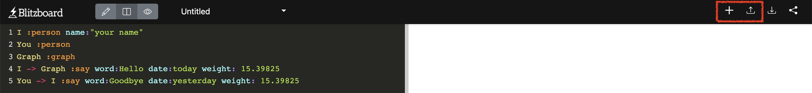

# Create

## Create a new dashboard

Click the '+' button in the menu bar.

## Edit the dataset

Open the data editor and edit the datasets in the property graph format. This format is a general method to describe the complex structures of real-world entities and relationships flexibly.
