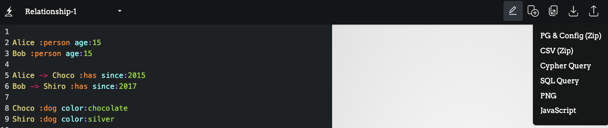
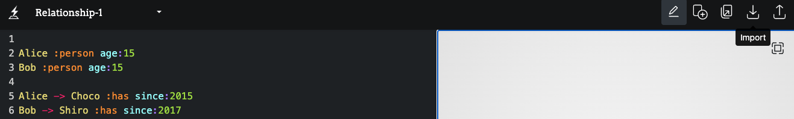
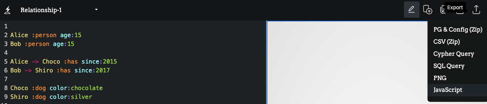

# Share

## Export into a zip file (PG & Config)



This option exports a dataset and configuration settings into a single zip file. This is useful to keep the package permanently on your local disk and to share it with others.

Each zip package contains two files below:

- graph.pg
- config.js

## Import from a zip file

Click the Import button in the menu bar, and upload **a zip file** previously exported.



## Embed into your pages



This option exports a dataset, configuration settings, and essential JavaScript packages together. With this JavaScript file, you can embed the visualization into a HTML code as follows:

Load scripts in the header of the your html:

```html
<script src="https://cdn.jsdelivr.net/gh/blitzboard/blitzboard/dist/blitzboard.bundle.min.js"></script>
```

Place div tag with `id='blitzboard'`:

```html
<div style="width:100%; height: 500px;" id="blitzboard"></div>
```

Download `<name>_<datetime>.js`, and add this file path after the items above:

```html
<script src="./<name>_<datetime>.js"></script>
```

You can also call the API with graph data (in .pg format) and config:

```javascript
let blitzboard = new Blitzboard(document.getElementById("blitzboard"));
blitzboard.update(pg, config);
```
